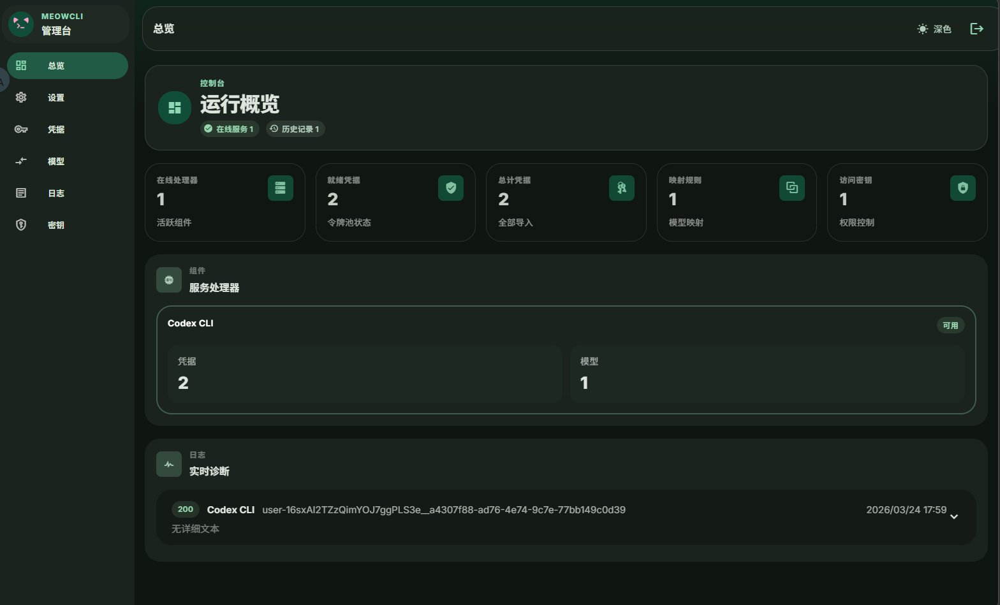
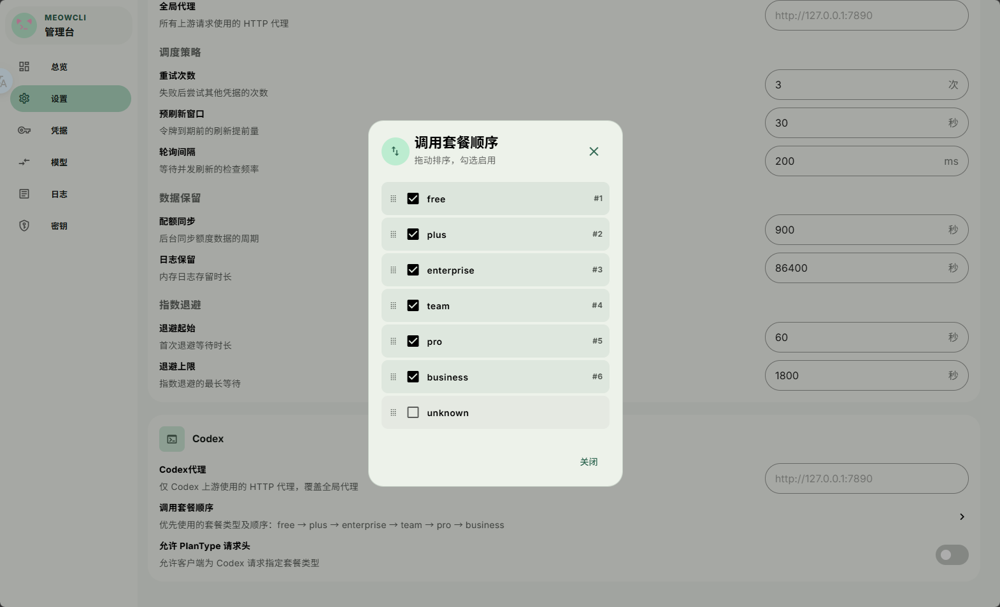
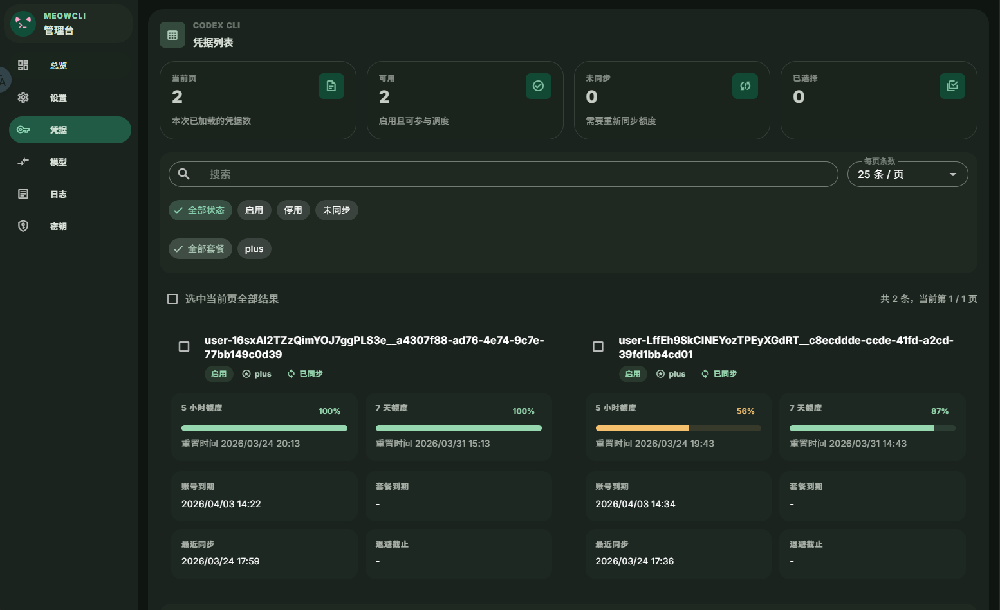

# MeowCLI

MeowCLI 是一个注重高性能，更优调度的API转发服务

## 特性

- 开箱即用，可使用SQLite/PostgreSQL，且使用sqlc生成代码，优化查询速度
- 跟随对话更新额度， 5 小时和 7 天窗口的剩余额度与重置时间综合评分，优先选择最优凭据，并在失败后自动选择基于 `Retry-After` 或指数退避的临时熔断
- 如未近期未对话，后台也会定时拉取上游 Quota
- 前端使用 Nuxt SSG 构建
- 使用atomic和otter缓存，规避延时大的SQL操作
- 缓存层过期自动刷新access_token，无需干预
- 可创建多个Key用于内部分发

## 效果图



## 快速开始
### 管理面板

浏览器打开：

```text
http://127.0.0.1:3000/admin
```

首次启动时，页面会提示创建第一个管理员密钥


### 配置模型映射

调用模型接口之前，需要先在管理台创建模型映射


- `alias`：对外暴露的模型别名
- `origin`：真实上游模型名
- `handler`：映射的CLI类型


### 创建接口调用密钥

在管理台“密钥”页面创建一个 `user` 或 `admin` 密钥

- `admin`：完整的管理权限
- `user`：只能访问模型接口
注意：
- 日志只保存在内存中，服务重启后会清空
- 日志保留时间可以在设置页调整

## 配置方式

### 环境变量

| 变量名 | 说明 | 默认值 |
| --- | --- | --- |
| `LISTEN_ADDR` | 服务监听地址 | `:3000` |
| `DATABASE_URL` | 数据库地址；为空时使用 SQLite 文件 | `meowcli.db` |
| `DB_TYPE` | 数据库类型，支持 `sqlite` / `postgres` | `sqlite` |


## todo

- 当前实际注册的后端只有 `codex`，后续会加GeminiCLI等
- 目前无格式转换，完整透传
- 我不会写前端，所以前端是纯AI的（包括你现在看的readme.md，我懒得写）
- 
## 开发指南

### 环境要求

- Go 1.25+
- Node.js 22+
- （可选）[sqlc](https://sqlc.dev/) — 修改 SQL 后重新生成代码

### 本地开发

```bash
# 仅启动后端（不编译前端）
make serve

# 启动前端开发服务器（Nuxt HMR）
make dev-admin

# 完整构建（前端 SSG + Go 二进制）
make build-all
```

### 常用命令

```bash
make sqlc          # 重新生成 sqlc 代码
make cross         # 交叉编译所有平台
make docker        # 构建 Docker 镜像
make clean         # 清理构建产物
```

### 发布流程

打 tag 推送后 GitHub Actions 自动构建并发布：

```bash
git tag v0.1.0
git push origin v0.1.0
```

CI 会自动完成：交叉编译 6 个平台二进制 → 生成 checksum → 创建 GitHub Release → 构建并推送 Docker 镜像到 GHCR

## 项目结构

```text
main.go                 程序入口
internal/app            应用装配、配置加载、服务启动
internal/router         路由注册
internal/bridge         转发逻辑
internal/handler        /admin API 与 web/dist 分发入口
web                     Nuxt 管理台源码与 SSG 产物
core/codex              凭据缓存、刷新、调度、额度同步
api/codex               上游 Codex HTTP 客户端
db/sqlite               SQLite store 与 SQL
db/postgres             PostgreSQL store 与 SQL
internal/db/*           sqlc 生成代码
utils                   常量、枚举与通用工具
```
